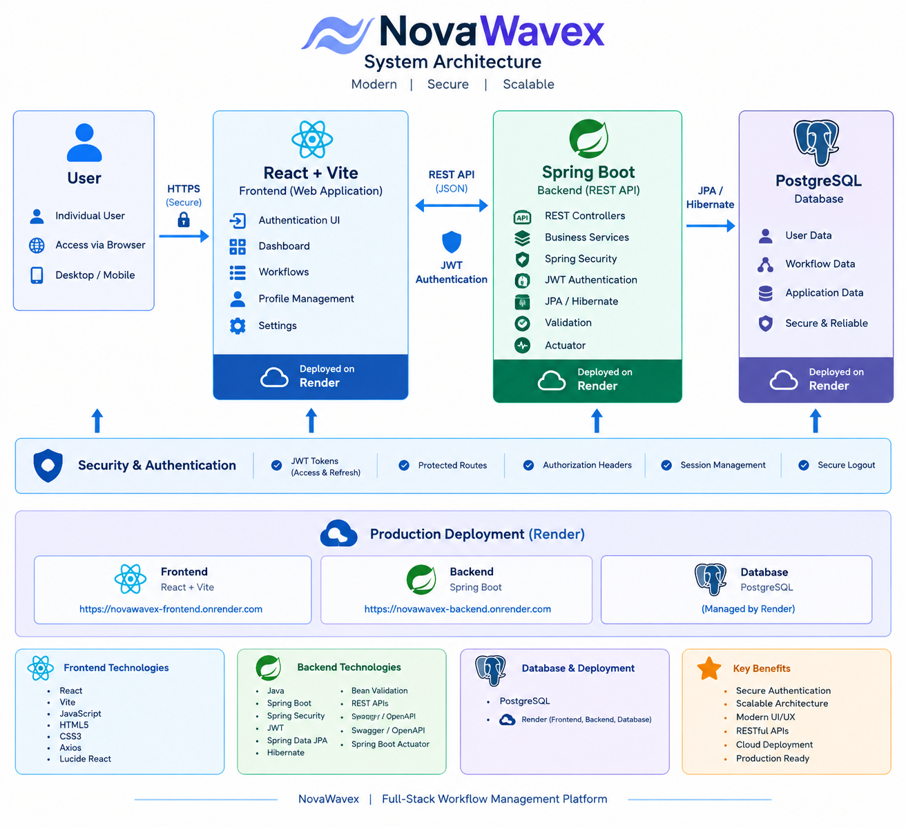
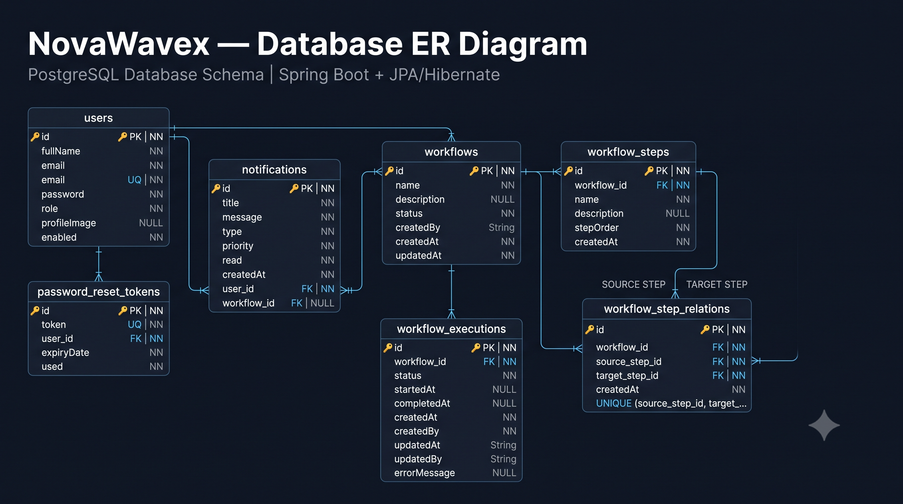

# NovaWavex

### Full-Stack Workflow Management Platform

NovaWavex is a modern full-stack workflow management platform built to provide secure authentication, workflow management, user account management, and a centralized command-center style interface.

The frontend is built with **React and Vite** and communicates with a **Spring Boot REST API** secured using JWT authentication.

## 🌐 Live Demo

**Live Application:**
https://novawavex-frontend.onrender.com

**Frontend:** React + Vite
**Backend:** Spring Boot
**Database:** PostgreSQL
**Deployment:** Render

---

## 📌 Overview

The NovaWavex frontend provides the user-facing interface for managing workflows and user accounts through a modern responsive web application.

It communicates with the NovaWavex Spring Boot backend through REST APIs and uses JWT-based authentication to protect authenticated resources.

The application includes authentication, dashboard functionality, workflow management, user profile management, settings, and password recovery features.

---

## ✨ Features

### 🔐 Authentication

* User registration
* User login
* JWT-based authentication
* Protected routes
* Automatic authentication state management
* Logout
* Forgot-password flow
* Password reset flow
* Change-password functionality

### 📊 Dashboard

* Centralized command-center interface
* System health information
* Backend health integration
* Workflow information
* Application navigation
* User account access

### ⚙️ Workflow Management

* View workflows
* Search workflows
* Filter workflows by status
* Create workflows
* View workflow details
* Edit workflows
* Delete workflows
* Workflow status management
* User-specific workflow access

Supported workflow statuses:

* `DRAFT`
* `ACTIVE`
* `COMPLETED`
* `CANCELLED`

### 👤 User Profile

* View user profile
* Full name
* Email/account information
* Profile image
* Profile management

### ⚙️ Settings

* Notification preferences
* Interface preferences
* Password change
* Account and security settings

### 🛡️ Security

The frontend integrates with the secured Spring Boot backend using:

* JWT authentication
* Authorization headers
* Protected routes
* Authenticated API requests
* Session management
* Secure logout handling

---

## 🛠️ Technology Stack

### Frontend

* **React**
* **Vite**
* **JavaScript**
* **HTML5**
* **CSS3**
* **Axios**
* **Lucide React**

### Backend

* **Java**
* **Spring Boot**
* **Spring Security**
* **JWT**
* **Spring Data JPA**
* **Hibernate**
* **Bean Validation**
* **REST APIs**
* **Swagger / OpenAPI**
* **Spring Boot Actuator**

### Database

* **PostgreSQL**

### Deployment

* **Render**

---

# 🏗️ System Architecture

NovaWavex follows a full-stack architecture where the React frontend communicates with a Spring Boot REST API using authenticated HTTP requests.

The backend handles business logic, authentication, authorization, workflow management, notifications, and database operations.

### Architecture Diagram



---

## 🏗️ Frontend Architecture

The frontend follows a component-based React architecture.

```text
src/
│
├── components/
│   ├── navigation/
│   ├── layout/
│   └── ...
│
├── pages/
│   ├── Login
│   ├── Register
│   ├── Dashboard
│   ├── Workflows
│   ├── Profile
│   ├── Settings
│   ├── Forgot Password
│   └── Reset Password
│
├── services/
│   ├── api.js
│   ├── authService.js
│   ├── userService.js
│   └── workflowService.js
│
├── context/
│   └── AuthContext
│
├── routes/
│   └── ProtectedRoute
│
└── App
```

The exact folder structure may evolve as the application continues to be developed.

---

## 🔌 Backend Integration

The frontend communicates with the Spring Boot backend using REST APIs.

The main service layers include:

```text
api.js
   │
   ├── Authentication APIs
   │
   ├── User APIs
   │
   └── Workflow APIs
```

Axios is used for HTTP communication and authenticated requests include the JWT in the authorization header.

---

## 🔑 Authentication Flow

The authentication flow works approximately as follows:

```text
User
 │
 ▼
Login Page
 │
 ▼
POST /api/auth/login
 │
 ▼
Spring Boot Backend
 │
 ▼
JWT Token
 │
 ▼
Frontend Authentication Context
 │
 ▼
Protected Application Routes
 │
 ▼
Authenticated API Requests
```

The frontend stores the authenticated session information and uses the JWT when communicating with protected backend endpoints.

---

# 🗄️ Database Design

NovaWavex uses **PostgreSQL** as its relational database.

The database design supports:

* User accounts
* Password reset tokens
* Notifications
* Workflows
* Workflow executions
* Workflow steps
* Workflow step relationships

### Database ER Diagram



---

## 🚀 Running Locally

### 1. Clone the repository

```bash
git clone https://github.com/hemantkr26/novawavex-frontend.git
```

### 2. Navigate to the project

```bash
cd novawavex-frontend
```

### 3. Install dependencies

```bash
npm install
```

### 4. Start the development server

```bash
npm run dev
```

The Vite development server normally runs at:

```text
http://localhost:5173
```

### 5. Start the backend

The frontend requires the NovaWavex Spring Boot backend to be running for authentication, workflows, user data, and other API functionality.

The backend normally runs locally at:

```text
http://localhost:8080
```

---

## 🌍 Production Deployment

NovaWavex is deployed in a production environment using Render.

```text
                    User
                      │
                      ▼
          ┌─────────────────────┐
          │   React Frontend    │
          │       Render        │
          └──────────┬──────────┘
                     │
                     │ REST API + JWT
                     ▼
          ┌─────────────────────┐
          │   Spring Boot API   │
          │       Render        │
          └──────────┬──────────┘
                     │
                     ▼
          ┌─────────────────────┐
          │     PostgreSQL      │
          │       Render        │
          └─────────────────────┘
```

### Production Frontend

https://novawavex-frontend.onrender.com

---

# 📚 Project Documentation

NovaWavex includes dedicated documentation for the major technical aspects of the project.

### 🏗️ Architecture

The system architecture diagram illustrates the relationship between the frontend, backend, authentication layer, and database.

### 🗄️ Database

The ER diagram documents the PostgreSQL database structure and relationships between the application's major entities.

### 🔌 API Documentation

Complete REST API documentation is available in:

[`docs/API-DOCUMENTATION.md`](docs/API-DOCUMENTATION.md)

The API documentation covers:

* Authentication endpoints
* User management endpoints
* Profile management
* Password management
* Workflow endpoints
* Notification endpoints
* Request DTOs
* Response DTOs
* Validation rules
* JWT authentication
* HTTP status codes
* Supported enum values

---

## 📁 Project Structure

The frontend is organized around reusable React components, application pages, authentication state, API services, routing, and project documentation.

```text
NovaWavex Frontend
│
├── public/
│   └── images/
│       ├── novawavex-architecture.png
│       └── novawavex-database-erd.png
│
├── src/
│   ├── components/
│   ├── pages/
│   ├── services/
│   ├── context/
│   ├── routes/
│   └── ...
│
├── docs/
│   └── API-DOCUMENTATION.md
│
├── package.json
├── vite.config.js
├── index.html
└── README.md
```

---

## 🧪 Development & Testing

The frontend is developed alongside a tested Spring Boot backend.

The overall NovaWavex project includes testing across areas such as:

* Authentication
* JWT handling
* User services
* Workflow services
* Controllers
* Security
* Repository operations
* Integration behavior

---

## 🔒 Environment Configuration

Production configuration uses environment-based settings rather than hard-coding sensitive credentials.

Sensitive values such as:

* Database credentials
* JWT secrets
* Email credentials
* Production configuration

are kept outside the source code.

**Never commit secrets, passwords, API keys, or production credentials to GitHub.**

---

## 🚧 Future Improvements

Potential future improvements include:

* Advanced workflow execution capabilities
* More detailed workflow analytics
* Improved notification system
* Expanded team collaboration
* Additional workflow automation
* More comprehensive production monitoring
* Further UI and accessibility improvements

---

## 👨‍💻 Author

**Hemant Kumar**

B.Tech — Computer Science & Engineering

Portfolio:
https://hemantkrportfolio.netlify.app/

GitHub:
https://github.com/hemantkr26

---

## ⭐ NovaWavex

NovaWavex demonstrates a complete full-stack development workflow—from frontend development and REST API integration to authentication, database management, testing, security hardening, and cloud deployment.
